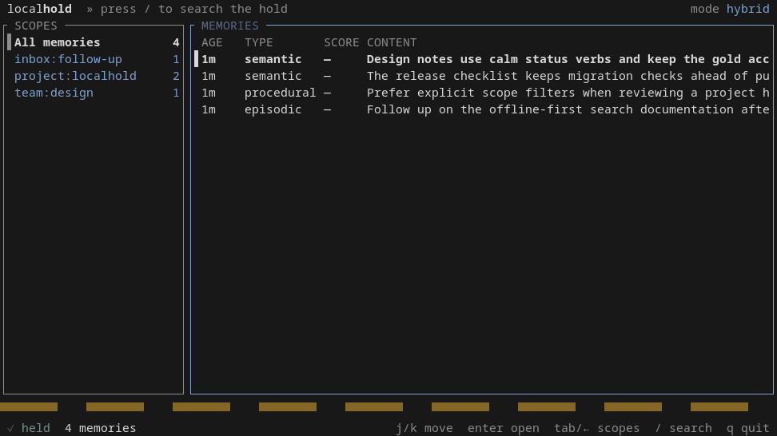

[](https://github.com/gearboxlogic/localhold/actions/workflows/ci.yml)
[](https://github.com/gearboxlogic/localhold/releases/latest)
[](LICENSE)

**LocalHold is local memory for AI agents.** It runs as a standalone
[Model Context Protocol](https://modelcontextprotocol.io/) server and keeps
durable, searchable context on your own machine — independent of any one
agent, editor, or model provider.

The mark on the banner is a keep with its door standing open. There is no lock
on the hold, because there is no lock-in: memories live in a plain SQLite file
you can read, back up, migrate, or walk away with. Every agent you run can
remember into the same store and recall from it later, and the record stays
yours.

LocalHold is in early beta. Linux CPU is the primary supported environment;
Windows, PostgreSQL, and CUDA reranking are preview surfaces.

## What It Provides

- one durable store shared by every agent: scoped memories, access policies,
  audit history, and maintenance tools
- keyword, semantic, hybrid, and text fallback search
- MCP over stdio or streamable HTTP
- SQLite storage by default, with optional PostgreSQL and `pgvector`
- OpenAI-compatible embedding endpoints — local servers such as vLLM,
  llama.cpp, and Ollama, or cloud providers
- optional ONNX cross-encoder reranking on CPU or CUDA
- `hold ui`, a terminal browser over everything the store holds

Storage is local by default. When an external embedding provider is enabled,
memory content and search queries are sent to the configured endpoint. LocalHold
does not start or manage model servers.

## Quickstart

Install a [release archive](https://github.com/gearboxlogic/localhold/releases)
— Linux x86_64 CPU and CUDA 12, plus a Windows x86_64 preview — or build from
source:

```sh
git clone https://github.com/gearboxlogic/localhold.git
cd localhold
./script/install.sh
export PATH="$HOME/.local/bin:$PATH"
hold
```

Then point an MCP client at the binary over stdio:

```json
{
  "mcpServers": {
    "localhold": {
      "command": "/absolute/path/to/hold"
    }
  }
}
```

For clients with a command-based setup:

```sh
claude mcp add --scope user localhold /absolute/path/to/hold
```

That is the whole setup. Out of the box search is keyword and text only —
fully local, no model servers, nothing to download. Configure an embedding
endpoint later for semantic search. See [Installation](docs/installation.md)
for prerequisites, archive verification, and client details.

## Browse The Hold

`hold ui` opens an interactive terminal browser over the store: scopes in the
left pane; search mode cycling across keyword, text, semantic, hybrid, and auto;
and a detail view with each memory's audit trail. Auto chooses the best
available retrieval fallback. Browsing is side-effect-free; edits and deletions
go through the normal audited authorization path.



The recording uses an explicitly selected hybrid browse mode before switching
to keyword search, then opens the selected memory's detail view.

See [Browse The Hold](docs/browse.md) for navigation and editing keys.

## Configuration

LocalHold reads `~/.config/localhold/localhold.toml` on Linux and the
equivalent platform user-config directory elsewhere; it never loads config
implicitly from the current working directory. Runtime overrides use
`LOCALHOLD_*` environment variables. `hold config init` creates a starter file,
and `hold config validate` checks the effective settings without opening
storage. See [localhold.example.toml](localhold.example.toml) for the complete
configuration surface.

To enable semantic search, configure an OpenAI-compatible `/v1` endpoint:

```toml
[embedding]
provider = "openai_compatible"
dimensions = 768

[embedding.openai_compatible]
base_url = "http://127.0.0.1:8000/v1"
model = "nomic-embed-text"
```

To enable the built-in cross-encoder reranker:

```toml
[search.reranker]
enabled = true
execution_provider = "cpu"
```

LocalHold records the vector space that produced stored embeddings and refuses
to mix a different one; `hold embeddings reindex --yes` rebuilds vectors after a
provider change. See [Embedding Providers](docs/embedding-providers.md) for
authentication, health checks, and transport security, and
[Operations](docs/operations.md) for reranker artifacts, execution providers,
precision, and HTTP deployment.

## Storage

SQLite is the default backend, stored under
`~/.local/share/localhold/localhold.db`. `hold backup` and `hold restore`
provide WAL-consistent online backups with validation, and `hold doctor`
checks installation and runtime readiness. PostgreSQL is opt-in, and
`hold migrate sqlite-to-postgres` moves an existing store across. See
[Operations](docs/operations.md) for backup, restore, migration, and
diagnostics.

## MCP Tools

The everyday API consists of `brief`, `recall`, `read`, `read_many`,
`remember`, `remember_many`, `handoff`, `revise`, and `forget`. Maintenance and
migration operations use explicit `admin_*` tools, which are removed from
discovery and dispatch unless an operator enables them for a dedicated
maintenance instance.

See [Agent API](docs/agent-api.md) for tool semantics,
[Architecture](docs/architecture.md) for the system design,
[Operations](docs/operations.md) for running LocalHold, and the
[Compatibility Policy](docs/compatibility.md) for what upgrades preserve.

## Development

```sh
./script/bootstrap.sh
just test
just check
```

`just check` runs formatting, clippy, dependency policy, and tests; Linux and
Windows checks also run in GitHub Actions. See
[CONTRIBUTING.md](CONTRIBUTING.md) before opening a pull request and
[SECURITY.md](SECURITY.md) for vulnerability reporting.

## License

Copyright 2026 Gearbox Logic LLC.

Licensed under the [Apache License 2.0](LICENSE). The license does not grant
rights to LocalHold or Gearbox Logic trademarks; see [TRADEMARKS.md](TRADEMARKS.md).
Third-party components and models retain their respective licenses.
